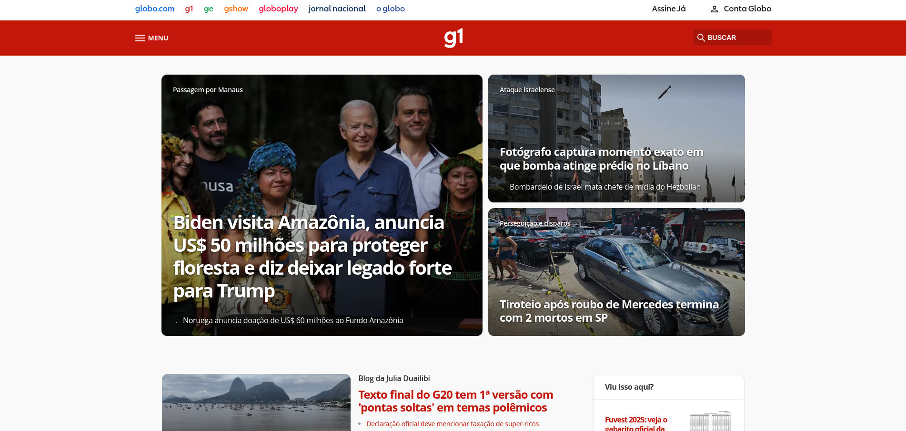
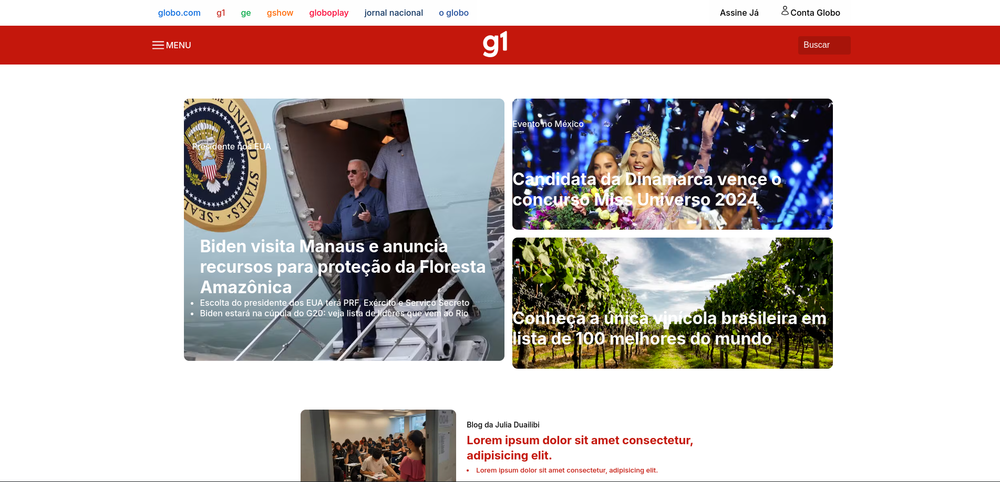
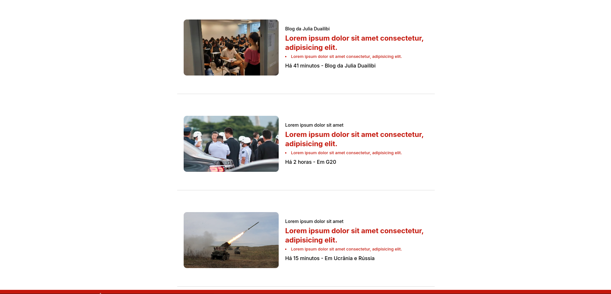
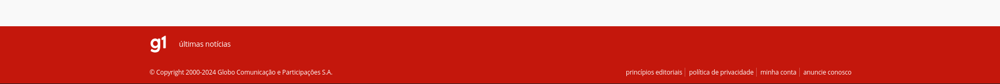

# Proposta de Componentização do portal G1

Aluno: Raphael Honorato e Silva

Realizei a componentização de alguns itens que achei pertinentes.

O Header separei em 2 componentes que foi a lista de links principal e o Menu, os banners, cards e o footer.

[Link do repositório](https://github.com/raphahonorato/pti-web-camadas)

[Portal do G1](https://g1.globo.com/)

---

### Header Original


### Header Componente

```xml
 <Header />

 <Menu />
```


---

### Banner Original



### Banner Componente

```xml
      <Banner />
```



---

### Card Original


### Card Componente

```xml
      <Card
        imagem="caminho/da/imagem"
        obs="Texto de observação"
        titulo="Título da Notícia"
        li="texto em tópico"
        autor="Autor da notícia"
      />
```



---

### Footer Original



### Footer Componente

```xml
      <Footer />
```


