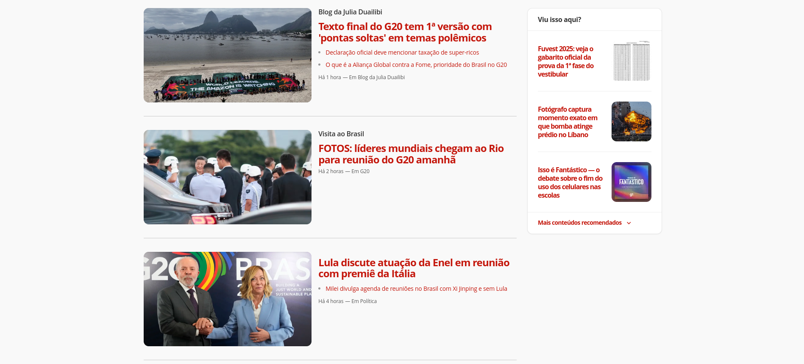

# Réplica do site do G1

Aluno: Raphael Honorato e Silva

Realizei a componentização de alguns itens que achei pertinentes.

O Header separei em 2 componentes que foi o Header principal e o Menu, os banners, cards e o footer.

Proposta de Componentização do portal G1

### Header Original

### Header Componente

### Banner Original

### Banner Componente

### Footer Original

### Footer Componente

